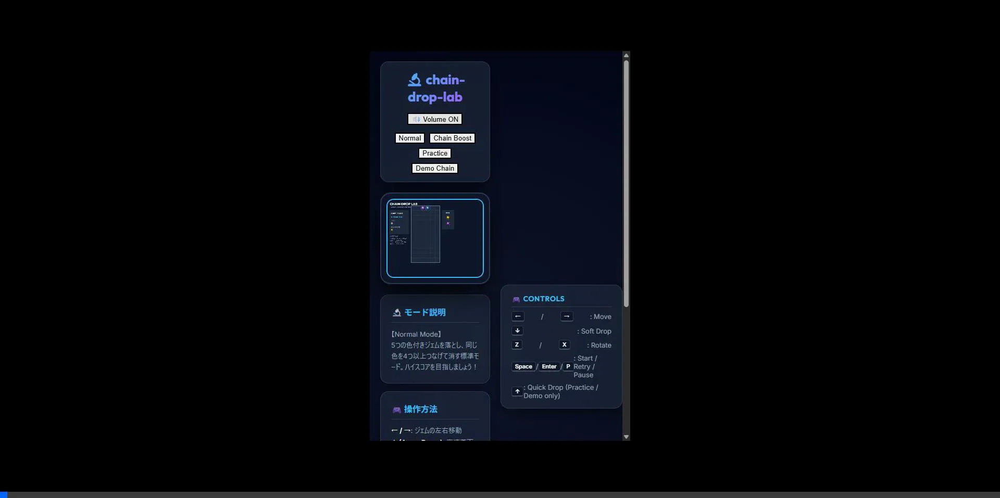
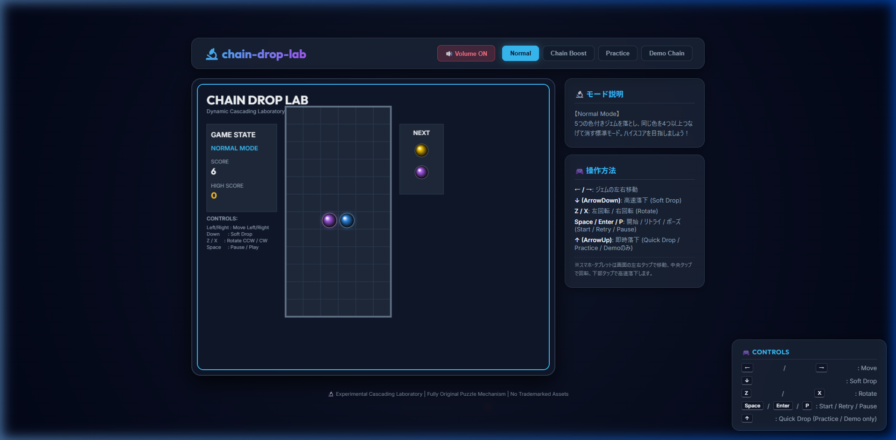
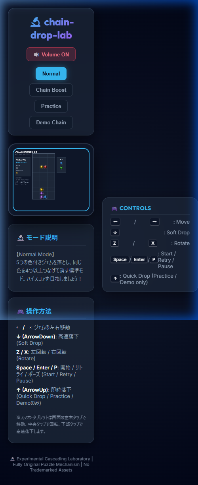

# 🔬 chain-drop-lab (チェイン・ドロップ・ラボ)

<p align="center">
  
</p>

`chain-drop-lab` は、ブラウザで動作する完全オリジナルの**「落ち物連鎖パズルゲーム（falling chain puzzle game）」**です。
美しく洗練された Canvas 描画エフェクト、Web Audio API によるシンセサイザー効果音、そして「超大連鎖を極めて簡単に体験できること」を最優先して作られた、商用利用可能かつクリーンなオープンソースソフトウェア（OSS）です。

---

## 🌐 Live Demo & Deployment

現在、GitHub Pages 上でオンラインデモが即座にプレイ可能です！
- **Live Demo (Webサイト)**: [https://aicoderproject.github.io/chain-drop-lab/](https://aicoderproject.github.io/chain-drop-lab/)
- **GitHub Repository**: [https://github.com/AICoderProject/chain-drop-lab](https://github.com/AICoderProject/chain-drop-lab)

### 📸 Screenshots

| Desktop Layout | Mobile Layout (under 900px width) |
| :---: | :---: |
|  |  |

---

## 🌟 主な特徴

- **完全オリジナルの安全性 (100% Asset-Free)**:
  - 実在する他社の落ち物パズルゲームの商標（例：「ぷよぷよ」「Puyo Puyo」等）や、ロゴ、キャラクター、著作権のある画像・音声素材は一切使用していません。
  - すべて HTML5 Canvas を用いた動的ベクター描画および Web Audio API を用いたリアルタイム波形合成（自作SE）で実装されています。商用プロジェクトへの組み込みや、GitHubでの教育用OSSとしての公開に最適です。
- **圧倒的な大連鎖の爽快感 (Juice & Feedback)**:
  - 盤面がダイナミックに揺れる「画面揺れ（Camera Shake）」エフェクト。
  - ジェム消去時にきらめき飛び散る「極彩色パーティクル」演出。
  - 連鎖数に応じてポップアップする「巨大な動的3D風コンボテキスト」。
  - 連鎖の進行とともにドレミファソラシドの音階でピッチが上がっていく心地よい効果音。
- **誰でも大連鎖ができる初心者フレンドリーなモード**:
  - **Chain Boost Mode**: ジェムの色数を減らすことで、適当に落とすだけで勝手に大連鎖が巻き起こる爽快感特化モード。
  - **Demo Chain Mode**: コンピュータによる全自動プレイで、目の覚めるような15連鎖以上の芸術的な積み木と連鎖を鑑賞・学習できるモード。
- **教材としての高い品質 (Educational Standard)**:
  - TypeScript によるオブジェクト指向の美しい設計。
  - 外部ライブラリへの依存度を極限まで低減（ビルド・開発ツールを除き、ランタイム依存ライブラリはゼロ）。
  - Vitest を用いた盤面ロジック（連結・落下・連鎖）の徹底したユニットテスト。
  - プライベートブラウジング等で `localStorage` が無効化されていても絶対にクラッシュしない、安全なセーブデータラッパー。

---

## 🎮 ゲームモードと操作方法

### ゲームモード
1. **Normal Mode**: 標準的な難易度で、自己ベストのハイスコアを目指す本格的なパズルモード。
2. **Chain Boost Mode**: 配色や色数が3色に調整され、初心者でも簡単に10連鎖以上を連発できる爽快モード。
3. **Practice Mode**: ゲームオーバーがなく、いつでもプレイの練習や連鎖構築の実験ができるモード。
4. **Demo Chain Mode**: コンピュータが自律的に超大連鎖を組んで実行する全自動鑑賞モード。

### 操作方法
- **`←` / `→` (ArrowLeft / ArrowRight)**: ジェムの左右移動
- **`↓` (ArrowDown)**: 高速落下 (ソフトドロップ)
- **`Z`**: 反時計回りに回転
- **`X`**: 時計回りに回転
- **`Space`**: ゲームの開始 / リトライ / ポーズ
- **`↑` (ArrowUp)**: 即時落下（Practice / Demo モードのみ）
- **マウス・タッチ操作**: 画面の左右をタップして移動、中央付近をタップして回転、下部タップで高速落下が可能です。

---

## 🛠️ セットアップと開発手順

本プロジェクトは APIキーや Secrets を一切使用しないため、誰でも簡単にローカルで起動・ビルド可能です。

### 前提条件
- Node.js (v18以上推奨)
- npm

### 1. 依存関係のインストール
プロジェクトのルートディレクトリで以下を実行します。
```bash
npm install
```

### 2. 開発サーバーの起動
ローカルでテストプレイやプレビューを行うための開発用サーバーを立ち上げます。
```bash
npm run dev
```

### 3. テストの実行
Vitest によるユニットテストを実行し、連結・消去・落下・連鎖判定などのコアロジックを検証します。
```bash
npm run test
```

### 4. リンターの実行
ESLint と Prettier を使用して、コードの品質とフォーマットをチェックします。
```bash
# Lint & Formatチェック
npm run lint
npm run format
```

### 5. プロダクションビルド
GitHub Pages などで公開するための静的ファイルをビルドします。
```bash
npm run build
```

### 6. 一元検証 (verify)
公開前にリント、テスト、ビルドを一括で安全にチェックします。
```bash
npm run verify
```

---

## 🚀 GitHub Pages への公開方法

本プロジェクトには GitHub Actions 用のワークフローがあらかじめ配置されており、`main` ブランチにプッシュするだけで自動的に公開デプロイが完了します。

1. 本リポジトリを GitHub にアップロードします（Secretsの追加は不要です）。
2. GitHub リポジトリの設定（Settings > Pages）で、ビルド・デプロイ元として **`GitHub Actions`** を選択します。
3. 自動的にテスト・ビルド・デプロイが走り、公開ページが反映されます。

---

## 📄 ライセンスについて

本リポジトリは **[MIT License](LICENSE)** に基づいて正式に公開されています。著作権表示を残す限り、個人・商業・教育用途を問わず、コードの改変・再配布が自由に許可されています。詳細は `LICENSE` ファイルをご参照ください。

---

## 📅 更新履歴 (Changelog)

- **v1.0.2** (2026-06-08)
  - On-screen controls guide added (画面上の操作方法表示を追加)
  - Responsive controls panel added (PC右下フローティング・モバイル画面下部インラインのレスポンシブ配置)
  - Existing keyboard mappings preserved (v1.0.1仕様の操作体系の完全維持)
  - Verified with ESLint, Vitest 17/17, and production build
- **v1.0.1** (2026-06-02)
  - キーボード操作レスポンスの飛躍的向上。
  - `Enter`（決定/ポーズ）および `P` キー（一時停止トグル）ショートカットの追加。
  - ボタンクリック操作後に自動で Canvas へフォーカスを戻す（`canvas.focus()`）制御を実装し、フォーカス競合バグを排除。
  - ArrowキーやSpaceによる不要なブラウザスクロールの防止。
  - キーイベントのシミュレーションテスト（Vitest）を新規導入。
- **v1.0.0** (2026-06-02)
  - 初回安定版リリース。
  - Normal, Chain Boost, Practice, Demo の4モードの実装。
  - Web Audio API による procedural（手続き的）な効果音シンセサイザーの搭載。
  - GitHub Actions による Pages 自動 CI/CD デプロイの完了。
  - 正式な MIT License の採択。

---

## 🔬 Developer Status Note
*This repository has been submitted for OpenAI Codex for Open Source consideration.*
