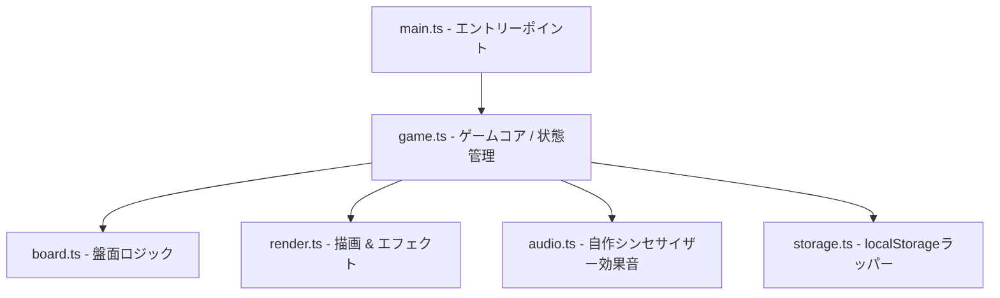

# chain-drop-lab アーキテクチャ解説

本プロジェクトは、Vite + TypeScript + HTML5 Canvas を使用した、完全自作の「落ち物連鎖パズルゲーム」です。外部フレームワークやアセットは一切使用せず、高パフォーマンスかつ軽量な実装となっています。

## システム構成図

## 各モジュールの役割

### 1. `main.ts`
- アプリケーションのエントリーポイント。
- DOMの読み込みを待機し、Canvas要素を取得して `Game` クラスを初期化します。

### 2. `game.ts` (Game Core)
- ゲームループ（`requestAnimationFrame`）を制御。
- `Normal`, `Chain Boost`, `Practice`, `Demo Chain` のゲームモード管理。
- ユーザー入力（キーボード、マウス、タッチ）を受け取り、落下ピースの移動・回転を命令。
- ゲームオーバー判定、スコア計算、ハイスコアの更新。

### 3. `board.ts` (Board Logic)
- $12 \times 6$（縦12マス・横6マス）の盤面グリッドの状態管理。
- ピース落下後の「同色4個以上の連結判定」（幅優先探索 / 深さ優先探索）。
- 重力による浮遊ブロックの落下処理。
- 連鎖（Chain）の再判定と、連鎖が途切れるまでのループ処理。

### 4. `render.ts` (Renderer)
- HTML5 Canvas への全描画処理。
- ジェムのぷにぷにした動きや、消滅時のパーティクル演出。
- 連鎖時のダイナミックな文字アニメーション（5連鎖、10連鎖以上の派手なエフェクト）。
- 消去・連鎖時の画面揺れ（Camera Shake）エフェクト。

### 5. `audio.ts` (Web Audio API)
- 外部音声ファイルを一切読み込まず、Web Audio API のオシレーター（OscillatorNode）を用いてリアルタイムに自作効果音を生成。
- 落下音、回転音、消去音、連鎖進行に応じた音階上昇効果音を合成。

### 6. `storage.ts` (Storage Wrapper)
- ブラウザの `localStorage` がプライベートブラウジング等で無効化されている環境でも例外落ちせず、安全にフォールバック（メモリ内保存）するラッパー。
