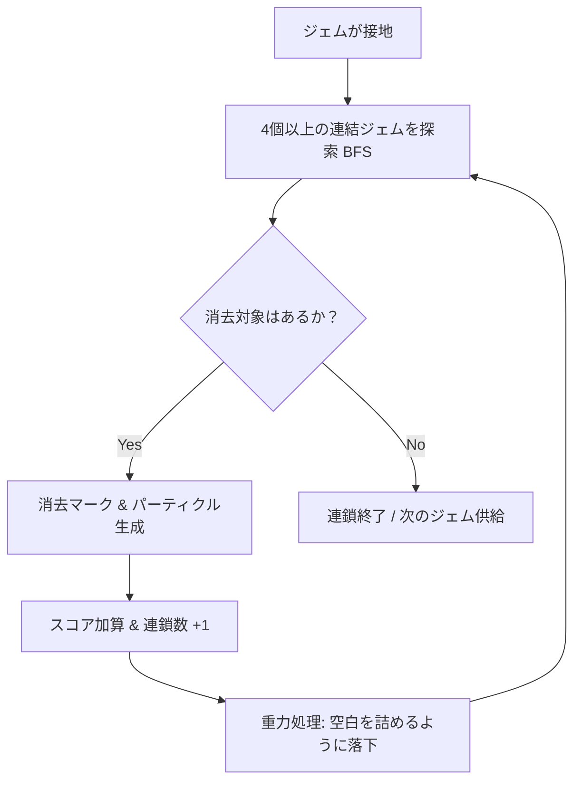

# chain-drop-lab 連鎖アルゴリズムと演出システム

本ゲームは「大連鎖の圧倒的な爽快感」を最優先して設計されています。その核となる連鎖ロジックと演出設計について解説します。

## 連鎖アルゴリズム

連鎖の処理は、ジェムが静止した瞬間に以下のループで実行されます。

### 1. 連結探索 (Breadth-First Search: BFS)
盤面の各マスを走査し、まだ訪問していないジェムから隣接する同色のジェムを上下左右に探索します。探索した連結グループのサイズが `4` 以上の場合、それらを「消去対象」としてマークします。

### 2. 重力落下処理
消去されたマス（空白）の上にあるジェムをすべて下にスライドさせます。
各列（縦ライン）について、下から上に向かって走査し、ジェムがあれば下に詰め、上の空白を埋めていきます。

## 初心者向け超連鎖サポート

初心者が簡単に大連鎖の気持ちよさを体験できるように、特別なモードを用意しています。

### Chain Boost Mode
- 登場するジェムの色数を通常（5色）から **3色** または **4色** に減少させます。
- 色数が少ないため、適当に置くだけで勝手にジェムが繋がり、10連鎖以上の大連鎖が極めて高い確率で発生します。
- ジェムの落下速度上昇を緩やかにし、じっくり考えることができます。

### Demo Chain Mode
- AI（全自動デモプレイ）が、盤面の下部から綺麗に連鎖が組めるように最適化された状態でジェムを配置し、大連鎖の実演を行います。
- コンピュータによる配置アルゴリズム：
  - 階段積みや挟み込みといった連鎖の基本形をシミュレートした特殊ジェム供給または、あらかじめ大連鎖が確定する美しいジェム配列を降らせることで、確定で15連鎖以上が発生する演出を提供します。

## 連鎖演出システム

連鎖のダイナミズムを強化するため、以下の視覚効果を組み込んでいます。

1. **画面揺れ (Camera Shake)**
   - 連鎖数に応じて画面の揺れ幅（振幅）と持続時間を大きくします。
   - 10連鎖を超えると、盤面全体が激しく揺れ動く大迫力のエフェクトになります。
2. **消滅パーティクル**
   - 消えたジェムの中心から、そのジェムと同じ色のきらめくパーティクルが飛び散り、フェードアウトしながら落下します。
3. **特大連鎖テキスト**
   - 画面中央に「5 CHAIN!」「10 CHAIN! SPECIAL!」といった巨大なフォントでテキストがポップアップし、バウンドや回転しながら表示されます。
4. **段階的ピッチ上昇効果音**
   - Web Audio API を用い、1連鎖、2連鎖、3連鎖と進むにつれて、効果音のピッチ（周波数）をドレミファソラシドの音階に沿って上昇させ、聴覚的にも連鎖の高揚感を高めます。
